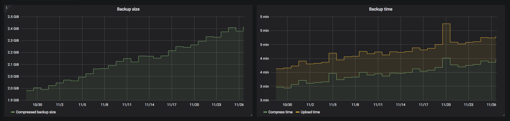
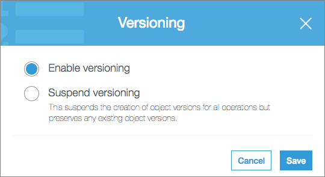
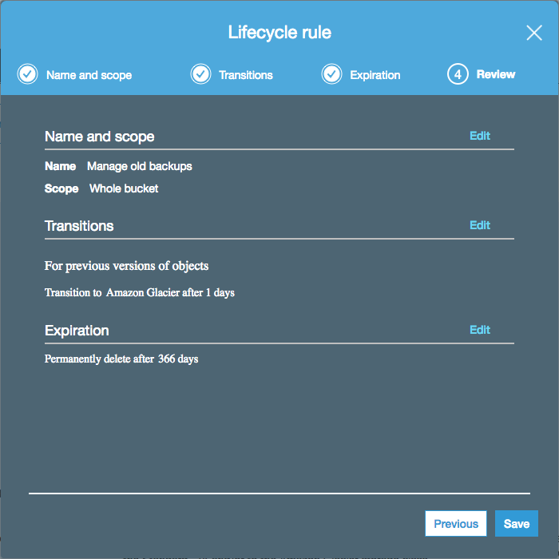

# 1121citrus/docker-volume-backup

## Synopsis
**This is a fork of [`jareware/docker-volume-backup`](https://www.github.com/jareware/docker-volume-backup).** It adds support for passing credentials and private keys using [secrets](https://docs.docker.com/engine/swarm/secrets/#use-secrets-in-compose) using new `AWS_ACCESS_KEY_ID_FILE`, `AWS_SECRET_ACCESS_KEY_FILE`, `GPG_PASSPHRASE_FILE`, `INFLUXDB_API_TOKEN_FILE`, and `INFLUXDB_CREDENTIALS_FILE` configuration variables. In each case the value of the `_FILE` form provides a default value for the ordinary variable. (i.e. `foo=${FOO:-$(cat ${FOO_FILE})}` in bash).

## Contents
- [Overview](#overview)
- [Examples](#examples)
  - [Backing up locally](#backing-up-locally)
  - [Backing up to S3](#backing-up-to-s3)
  - [Backing up to remote host by means of SCP](#backing-up-to-remote-host-by-means-of-scp)
  - [Triggering a backup manually](#triggering-a-backup-manually)
  - [Stopping containers while backing up](#stopping-containers-while-backing-up)
  - [Pre/post backup exec](#prepost-backup-exec)
- [Configuration](#configuration)
- [Metrics](#metrics)
- [Automatic backup rotation](#automatic-backup-rotation)
    - [Rotation for local backups](#rotation-for-local-backups)
    - [Rotation for backups tranferred via SCP](#rotation-for-backups-tranferred-via-scp)
    - [Rotation for S3 backups](#rotation-for-s3-backups)
- [Testing](#testing)
- [Building](#building)

## Overview

Docker image for performing simple backups of Docker volumes. Main features:

- Mount volumes into the container, and they'll get backed up
- Use full `cron` expressions for scheduling the backups
- Backs up to local disk, to remote host available via `scp`, to [AWS S3](https://aws.amazon.com/s3/), or to all of them
- Allows triggering a backup manually if needed
- Optionally stops containers for the duration of the backup, and starts them again afterward, to ensure consistent backups
- Optionally `docker exec`s commands before/after backing up a container, to allow easy integration with database backup tools, for example
- Optionally executes commands before/after backing up inside `docker-volume-backup` container and/or on remote host
- Optionally ships backup metrics to [InfluxDB](https://docs.influxdata.com/influxdb/), for monitoring
- Optionally encrypts backups with `gpg` before uploading
- Supports [secrets](https://docs.docker.com/engine/swarm/secrets/#use-secrets-in-compose) files for security tokens.

## Examples

### Backing up locally

```yml
services:
  backup:
    image: 1121citrus/docker-volume-backup
    volumes:
      # Local folder to be backed up
      - ./application-data:/backup/application-data:ro
      # Local folder as the backup directory
      - ./backups:/archive
```

This will back up the `./application-data` directory contents, once per day, and write it to `./backups` with a filename like `17760708T12000-backup.tar.gz`.

### Backing up to S3

Off-site backups are better, though:

```yml
services:
  backup:
    image: 1121citrus/docker-volume-backup
    environment:
      AWS_S3_BUCKET_NAME: my-backup-bucket # Bucket already exists
      AWS_ACCESS_KEY_ID_FILE: /run/secrets/aws_access_key_id
      AWS_SECRET_ACCESS_KEY_FILE: /run/secrets/aws_secret_access_key
    volumes:
      # Local folder to be backed up
      - ./application-data:/backup/application-data:ro
    secrets:
      - aws_access_key_id
      - aws_secret_access_key
```

This configuration will back up to AWS S3 instead. See below for additional tips about [S3 Bucket setup](#s3-bucket-setup).

### Backing up to remote host by means of SCP

You can also upload to your backups to a remote host by means of secure copy (SCP) based on SSH. To do so, [create an SSH key pair if you do not have one yet and copy the public key to the remote host where your backups should be stored.](https://foofunc.com/how-to-create-and-add-ssh-key-in-remote-ssh-server/) Then, start the backup container by setting the variables `SCP_HOST`, `SCP_USER`, `SCP_DIRECTORY`, and `SSH_KEY_FILE` (or provide the private SSH key by mounting it into `/ssh/id_rsa`).

In the example, we store the backups in the remote host folder `/home/pi/backups` and use the default SSH key located at `~/.ssh/id_rsa`:

```yml
services:
  backup:
    image: 1121citrus/docker-volume-backup
    environment:
      SCP_HOST: backup.acme-explosives.com
      SCP_USER: pi
      SCP_DIRECTORY: /home/pi/backups # Remote host directory
      SSH_KEY_FILE: /run/secrets/ssh_private_key
    volumes:
      # Local folder to be backed up
      - ./application-data:/backup/application-data:ro
    secrets:
      - ssh_private_key
```

### Triggering a backup manually

Sometimes it's useful to trigger a backup manually, e.g. right before making some big changes.

This is as simple as:

```
$ docker-compose exec backup ./backup.sh

[INFO] Backup starting

8 containers running on host in total
1 containers marked to be stopped during backup

...
...
...

[INFO] Backup finished

Will wait for next scheduled backup
```

If you **only** want to back up manually (i.e. not on a schedule), you should either:

1. Run the image without `docker-compose`, override the image entrypoint to `/root/backup.sh`, and ensure you match your env-vars with what the default `src/entrypoint.sh` would normally set up for you, or
1. Just use `BACKUP_CRON_EXPRESSION="#"` (to ensure scheduled backup never runs) and execute `docker-compose exec backup ./backup.sh` whenever you want to run a backup

### Stopping containers while backing up

It's not generally safe to read files to which other processes might be writing. You may end up with corrupted copies.

You can give the backup container access to the Docker socket, and label any containers that need to be stopped while the backup runs:

```yml
services:
  dashboard:
    image: grafana/grafana
    volumes:
      - grafana-data:/var/lib/grafana
    labels:
      # Adding this label means this container should be
      # stopped while it's being backed up:
      - "docker-volume-backup.stop-during-backup=true"

  backup:
    image: 1121citrus/docker-volume-backup
    environment:
      AWS_S3_BUCKET_NAME: my-backup-bucket
      AWS_ACCESS_KEY_ID_FILE: /run/secrets/aws_access_key_id
      AWS_SECRET_ACCESS_KEY_FILE: /run/secrets/aws_secret_access_key
    volumes:
      # Share Docker socket to use of the "stop-during-backup" feature
      - /var/run/docker.sock:/var/run/docker.sock:ro
      - grafana-data:/backup/grafana-data:ro
    secrets:
      - aws_access_key_id
      - aws_secret_access_key

volumes:
  grafana-data:
```

This configuration allows you to safely back up things like databases, if you can tolerate a bit of downtime.

### Pre/post backup exec

If you don't want to stop the container while it's being backed up, and the container comes with a backup utility (this is true for most databases), you can label the container with commands to run before/after backing it up:

```yml
services:
  database:
    image: influxdb
    volumes:
      - influxdb-data:/var/lib/influxdb
      - influxdb-temp:/tmp/influxdb
    labels:
      # These commands will be exec'd (in the same container)
      # before/after the backup starts:
      - docker-volume-backup.exec-pre-backup=influxd backup -portable /tmp/influxdb
      - docker-volume-backup.exec-post-backup=rm -rfv /tmp/influxdb
  backup:
    image: 1121citrus/docker-volume-backup
    volumes:
      - /var/run/docker.sock:/var/run/docker.sock:ro # Allow use of the "pre/post exec" feature
      - influxdb-temp:/backup/influxdb:ro # Temp space gets backed up
      - ./backups:/archive # Local folder as backup directory

volumes:
  influxdb-data:
  influxdb-temp:
```

The above configuration will perform a `docker exec` for the database container with `influxd backup`, right before the backup runs. The resulting DB snapshot is written to a temp volume (`influxdb-temp`), which is then backed up. Note that the main InfluxDB data volume (`influxdb-data`) isn't used at all, as it'd be unsafe to read while the DB process is running.

Similarly, after the temp volume has been backed up, it's cleaned up with another `docker exec` in the database container, this time just invoking `rm`.

If you need a more complex script for pre/post exec, consider mounting and invoking a shell script instead.

## Configuration

Variable | Default | Notes
--- | --- | ---
`BACKUP_SOURCES` | `/backup` | Where to read data from. This can be a space-separated list if you need to back up multiple paths, when mounting multiple volumes for example. On the other hand, you can also just mount multiple volumes under `/backup` to have all of them backed up.
`BACKUP_CRON_EXPRESSION` | `@daily` | Standard debian-flavored `cron` expression for when the backup should run. Use e.g. `0 4 * * *` to back up at 4 AM every night. See the [man page](http://man7.org/linux/man-pages/man8/cron.8.html) or [crontab.guru](https://crontab.guru/) for more.
`BACKUP_FILENAME` | `"%Y%m%dT%H%M%S-backup.tar.gz"` | File name template for the backup file. Is passed through `date` for formatting. See the [man page](http://man7.org/linux/man-pages/man1/date.1.html) for more.
`BACKUP_ARCHIVE` | `/archive` | When this path is available within the container (i.e. you've mounted a Docker volume there), a finished backup file will get archived there after each run.
`PRE_BACKUP_COMMAND` |  | Commands that is executed before the backup is created.
`POST_BACKUP_COMMAND` |  | Commands that is executed after the backup has been transferred.
`BACKUP_UID` | `root (0)` | After backup file has been moved to archive location the file user ownership is changed to this UID.
`BACKUP_GID` | `$BACKUP_UID` | After backup file has been moved to archive location the file group ownership is changed to this GID.
`BACKUP_WAIT_SECONDS` | `0` | The backup script will sleep this many seconds between re-starting stopped containers, and proceeding with archiving/uploading the backup. This can be useful if you don't want the load/network spike of a large upload immediately after the load/network spike of container startup.
`BACKUP_HOSTNAME` | `$(hostname)` | Name of the host (i.e. Docker container) in which the backup runs. Mostly useful if you want a specific hostname to be associated with backup metrics (see InfluxDB support).
`BACKUP_CUSTOM_LABEL` |  | When provided, the [start/stop](#stopping-containers-while-backing-up) and [pre/post exec](#prepost-backup-exec) logic only applies to containers with this custom label.
`CHECK_HOST` |  | When provided, the availability of the named host will be checked. The host should be the destination host of the backups. If the host is available, the backup is conducted as normal. Else, the backup is skipped.
`AWS_S3_BUCKET_NAME` |  | When provided, the resulting backup file will be uploaded to this S3 bucket after the backup has ran. You may include slashes after the bucket name if you want to upload into a specific path within the bucket, e.g. `your-bucket-name/backups/daily`.
`AWS_GLACIER_VAULT_NAME` |  | When provided, the resulting backup file will be uploaded to this AWS Glacier vault after the backup has ran.
`AWS_ACCESS_KEY_ID` |  | Must supply `AWS_ACCESS_KEY_ID` or `AWS_ACCESS_KEY_ID_FILE` when using `AWS_S3_BUCKET_NAME`.
`AWS_ACCESS_KEY_ID_FILE` |  | Must supply `AWS_ACCESS_KEY_ID` or `AWS_ACCESS_KEY_ID_FILE` when using `AWS_S3_BUCKET_NAME`.
`AWS_SECRET_ACCESS_KEY` |  | Must supply `AWS_SECRET_ACCESS_KEY` or `AWS_SECRET_ACCESS_KEY_FILE` when using `AWS_S3_BUCKET_NAME`.
`AWS_SECRET_ACCESS_KEY_FILE` |  | Must supply `AWS_SECRET_ACCESS_KEY` or `AWS_SECRET_ACCESS_KEY_FILE` when using `AWS_S3_BUCKET_NAME`.
`AWS_DEFAULT_REGION` |  | Optional when using `AWS_S3_BUCKET_NAME`. Allows you to override the AWS CLI default region. Usually not needed.
`AWS_EXTRA_ARGS` |  | Optional additional args for the AWS CLI. Useful for e.g. providing `--endpoint-url <url>` for S3-compatible systems, such as [DigitalOcean Spaces](https://www.digitalocean.com/products/spaces/), [MinIO](https://min.io/) and the like.
`SCP_HOST` |  | When provided, the resulting backup file will be uploaded by means of `scp` to the host stated.
`SCP_USER` |  | User name to log into `SCP_HOST`.
`SCP_DIRECTORY` |  | Directory on `SCP_HOST` where backup file is stored.
`SSH_KEY_FILE`| /ssh/id_rsa | Container pathspec for SSH private key
`PRE_SCP_COMMAND` |  | Command that is executed on `SCP_HOST` before the backup is transferred.
`POST_SCP_COMMAND` |  | Command that is executed on `SCP_HOST` after the backup has been transferred.
`GPG_PASSPHRASE` |  | When provided, the backup will be encrypted with gpg using this `passphrase`.
`GPG_PASSPHRASE_FILE` |  | When provided, the backup will be encrypted with gpg using the `passphrase` found in this file.
`INFLUXDB_URL` |  | Required when sending metrics to InfluxDB.
`INFLUXDB_MEASUREMENT` | `docker_volume_backup` | Required when sending metrics to InfluxDB.
`INFLUXDB_API_TOKEN` | | When provided, backup metrics will be sent to an InfluxDB instance using the API token for authorization. If API Tokens are not supported by the InfluxDB version in use, `INFLUXDB_CREDENTIALS` must be provided instead.
`INFLUXDB_API_TOKEN_FILE` | | When provided, backup metrics will be sent to an InfluxDB instance using the API token found in this file for authorization. If API Tokens are not supported by the InfluxDB version in use, `INFLUXDB_CREDENTIALS_FILE` must be provided instead.
`INFLUXDB_ORGANIZATION` | | Required when using `INFLUXDB_API_TOKEN`; e.g. `personal`.
`INFLUXDB_BUCKET` | | Required when using `INFLUXDB_API_TOKEN`; e.g. `backup_metrics`
`INFLUXDB_CREDENTIALS` |  | When provided, backup metrics will be sent to an InfluxDB instance using `user:password` authentication. Either `INFLUXDB_CREDENTIALS` or `INFLUXDB_CREDENTIALS_FILE` is required if `INFLUXDB_API_TOKEN` not provided.
`INFLUXDB_CREDENTIALS_FILE` |  | When provided, backup metrics will be sent to an InfluxDB instance using `user:password` authentication. Either `INFLUXDB_CREDENTIALS` or `INFLUXDB_CREDENTIALS_FILE` is required if `INFLUXDB_API_TOKEN` not provided.
`INFLUXDB_DB` |  | Required when using `INFLUXDB_URL`; e.g. `my_database`.
`TZ` | `UTC` | Which timezone should `cron` use, e.g. `America/New_York` or `Europe/Warsaw`. See [full list of available time zones](http://manpages.ubuntu.com/manpages/bionic/man3/DateTime::TimeZone::Catalog.3pm.html).

## Metrics

After the backup, the script will collect some metrics from the run. By default, they're just written out as logs. For example:

```
docker_volume_backup
host=my-demo-host
size_compressed_bytes=219984
containers_total=4
containers_stopped=1
time_wall=61.6939337253571
time_total=1.69393372535706
time_compress=0.171068429946899
time_upload=0.56016993522644
```

If so configured, they can also be shipped to an InfluxDB instance. This allows you to set up monitoring and/or alerts for them. Here's a sample visualization on Grafana:



## Automatic backup rotation

You probably don't want to keep all backups forever. A more common strategy is to hold onto a few recent ones, and remove older ones as they become irrelevant. There's no built-in support for this in `docker-volume-backup`, but you are able to trigger an external Docker container that includes [`rotate-backups`](https://pypi.org/project/rotate-backups/). In the examples, we draw on [docker-rotate-backups](https://github.com/jan-brinkmann/docker-rotate-backups).

In order to start an external Docker container, access to `docker.sock` has to be granted (as already seen in in the section on [stopping containers while backing up](#stopping-containers-while-backing-up)). Then, `docker-rotate-backups` can be run on local directories as well as on remote directories.

The default rotation scheme implemented in `docker-rotate-backups` preserves seven daily, four weekly, twelve monthly, and every yearly backups. For detailed information on customizing the rotation scheme, we refer to the [documentation](https://github.com/jan-brinkmann/docker-rotate-backups#how-to-customize).

### Rotation for local backups

Let `/home/pi/backups` be the path to your local backups. Then, initialize the environmental variable `POST_BACKUP_COMMAND` with the following command.
```
environment:
  POST_BACKUP_COMMAND: "docker run --rm -e DRY_RUN=false -v /home/pi/backups:/archive ghcr.io/jan-brinkmann/docker-rotate-backups"
volumes:
  - /var/run/docker.sock:/var/run/docker.sock:ro
  - /home/pi/backups:/archive
```

### Rotation for backups tranferred via SCP

Here, let `/home/pi/backups` be the backup directory on a remote host. To run `docker-rotate-backups` on that directory, the command in `POST_BACKUP_COMMAND` has to include all necessary information in order to access the remote host by means of SSH. Remember, if you transfer your [backups by means of SCP](#backing-up-to-remote-host-by-means-of-scp), all information in `SSH_USER`, `SSH_HOST`, `SSH_ARCHIVE`, and the SSH public key are already available.
```
environment:
  SCP_HOST: 192.168.0.42
  SCP_USER: pi
  SCP_DIRECTORY: /path/to/backups
  POST_BACKUP_COMMAND: "docker run --rm -e DRY_RUN=false -e SSH_USER=pi -e SSH_HOST=192.168.0.42 -e SSH_ARCHIVE=/home/pi/backups -v /home/pi/.ssh/id_rsa:/root/.ssh/id_rsa:ro ghcr.io/jan-brinkmann/docker-rotate-backups"
volumes:
  - /var/run/docker.sock:/var/run/docker.sock:ro
  - /home/pi/.ssh/id_rsa:/ssh/id_rsa:ro
```

### Rotation for S3 backups

Amazon S3 has [Versioning](https://docs.aws.amazon.com/AmazonS3/latest/dev/Versioning.html) and [Object Lifecycle Management](https://docs.aws.amazon.com/AmazonS3/latest/dev/object-lifecycle-mgmt.html) features that can be useful for backups.

First, you can enable versioning for your backup bucket:



Then, you can change your backup filename to a static one, for example:

```yml
environment:
  BACKUP_FILENAME: latest.tar.gz
```

This allows you to retain previous versions of the backup file, but the _most recent_ version is always available with the same filename:

    $ aws s3 cp s3://my-backup-bucket/latest.tar.gz .
    download: s3://my-backup-bucket/latest.tar.gz to ./latest.tar.gz

To make sure your bucket doesn't continue to grow indefinitely, you can enable some lifecycle rules:



These rules will:

- Move non-latest backups to a cheaper, long-term storage class ([Glacier](https://aws.amazon.com/glacier/))
- Permanently remove backups after a year
- Still always keep the latest backup available (even after a year has passed)

## Testing

A bunch of test cases exist under [`test`](test/). To run them:

    cd test/backing-up-locally/
    docker-compose stop && docker-compose rm -f && docker-compose build && docker-compose up

Some cases may need secrets available in the environment, e.g. for S3 uploads to work.

## Building

<!--
1. [Draft a new release on GitHub](https://github.com/1121citrus/docker-volume-backup/releases/new)
-->
1. `docker buildx build --platform linux/amd64,linux/arm64 -t 1121citrus/docker-volume-backup:latest -t 1121citrus/docker-volume-backup:x.y.z .`
